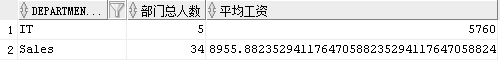
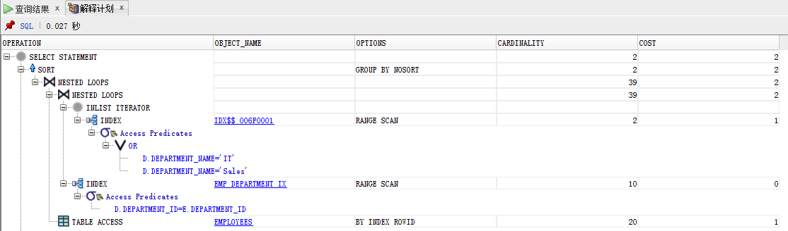
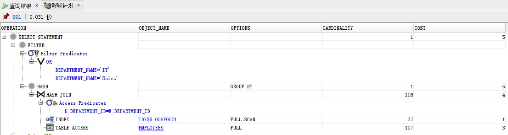
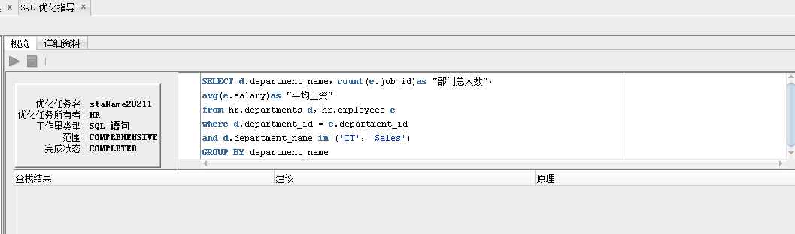
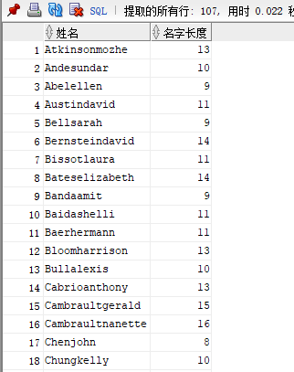
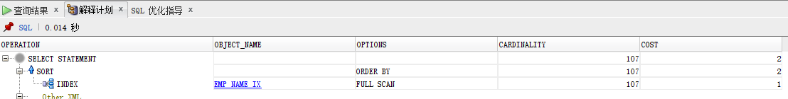
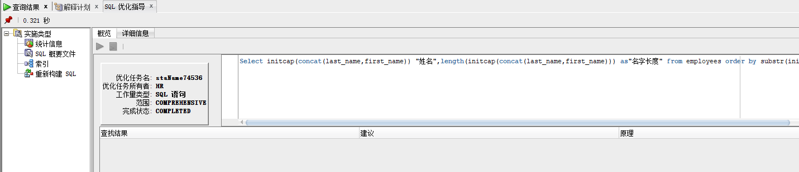

# 实验一报告
---
###查询结果

 

 _查询1,2结果一致_

###解释计划分析

 _查询1的解释计划_

 _查询2的解释计划_
 
一般而言，执行计划第一行所对应的COST(即成本耗费)值，反应了运行这段SQL的总体估计成本，单看这个总成本没有实际意义，但可以拿它与相同逻辑不同执行计划的SQL的总体COST进行比较，通常COST低的执行计划要好一些。
 可以从1，2的解释计划中看出1的耗费较低
 而且从索引来看查询一是**局部扫描**，而查询二是**全盘扫描**对于表的访问就比较慢
 查询一在索引可用性好的情况下采用嵌套循环达到高性能，而查询二采用哈希连接并全盘扫描性能大大不如查询一
 
 
>对于表的连接顺序，多数情况下使用的是嵌套循环，尤其是在索引可用性好的情况下，使用嵌套循环式最好的，但当ORACLE发现需要访问的数据表较大，索引的成本较高或者没有合适的索引可用时，会考虑使用哈希连接，以提高效率。排序合并连接的性能最差，但在存在排序需求，或者存在非等值连接无法使用哈希连接的情况下，排序合并的效率，也可能比哈希连接或嵌套循环要好。
 -----------------摘自http://blog.51cto.com/xiao1ang/1900950

###优化指导

 

 _没有优化建议_
---

- ###自定义查询
#####_将员工的姓名按首字母排序，并写出姓名的长度_
~~~sql
Select initcap(concat(last_name,first_name)) "姓名",length(initcap(concat(last_name,first_name))) as"名字长度"
 from employees order by substr(initcap(concat(last_name,first_name)),1,1);
~~~

 _查询结果_
 
 _解释计划_
 
 _优化指导_（没有建议）
