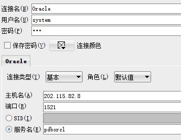
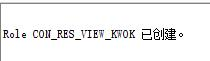
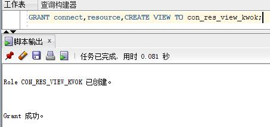
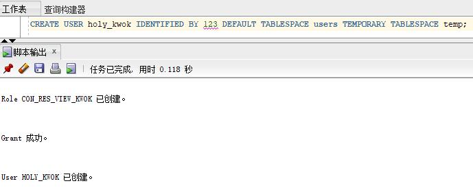
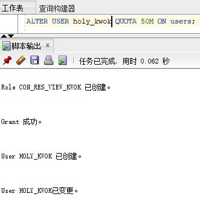
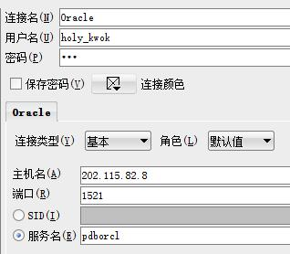
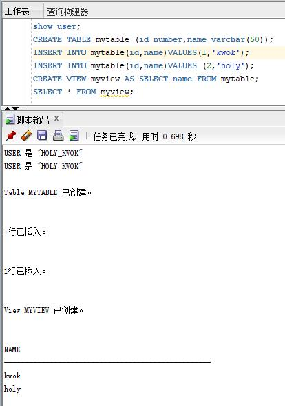
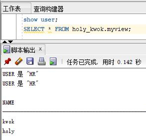
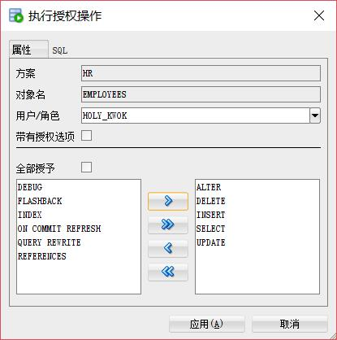

# 实验2：用户及权限管理

## 实验目的：

掌握用户管理、角色管理、权根维护与分配的能力，掌握用户之间共享对象的操作技能。

## 实验内容：
Oracle有一个开发者角色resource，可以创建表、过程、触发器等对象，但是不能创建视图。本训练要求：
- 在pdborcl插接式数据中创建一个新的本地角色con_res_view，该角色包含connect和resource角色，同时也包含CREATE VIEW权限，这样任何拥有con_res_view的用户就同时拥有这三种权限。
- 创建角色之后，再创建用户new_user，给用户分配表空间，设置限额为50M，授予con_res_view角色。
- 最后测试：用新用户new_user连接数据库、创建表，插入数据，创建视图，查询表和视图的数据。

## 实验步骤


- 第1步：以system登录到pdborcl，创建角色con_res_view_kwok和用户holy_kwok，并授权和分配空间：

```sql
$ sqlplus system/123@pdborcl
CREATE ROLE con_res_view_kwok;
GRANT connect,resource,CREATE VIEW TO con_res_view_kwok;
CREATE USER holy_kwok IDENTIFIED BY 123 DEFAULT TABLESPACE users TEMPORARY TABLESPACE temp;
ALTER USER holy_kwok QUOTA 50M ON users;
GRANT con_res_view_kwok TO holy_kwok;
```







- 第2步：新用户holy_kwok连接到pdborcl，创建表mytable和视图myview，插入数据，最后将myview的SELECT对象权限授予hr用户。

```sql
$ sqlplus holy_kwok/123@pdborcl
show user;
CREATE TABLE mytable (id number,name varchar(50));
INSERT INTO mytable(id,name)VALUES(1,'holy');
INSERT INTO mytable(id,name)VALUES (2,'kwok');
CREATE VIEW myview AS SELECT name FROM mytable;
SELECT * FROM myview;
GRANT SELECT ON myview TO hr;
```



- 第3步：用户hr连接到pdborcl，查询new_userholy_kwok授予它的视图myview

```sql
$ sqlplus hr/123@pdborcl
SELECT * FROM holy_kwok.myview;
```


>

## 数据库和表空间占用分析

> 当全班同学的实验都做完之后，数据库pdborcl中包含了每个同学的角色和用户。
> 所有同学的用户都使用表空间users存储表的数据。
> 表空间中存储了很多相同名称的表mytable和视图myview，但分别属性于不同的用户，不会引起混淆。
> 随着用户往表中插入数据，表空间的磁盘使用量会增加。

## 查看数据库的使用情况

以下样例查看表空间的数据库文件，以及每个文件的磁盘占用情况。

$ sqlplus system/123@pdborcl
```sql
SELECT tablespace_name,FILE_NAME,BYTES/1024/1024 MB,MAXBYTES/1024/1024 MAX_MB,autoextensible FROM dba_data_files  WHERE  tablespace_name='USERS';

SELECT a.tablespace_name "表空间名",Total/1024/1024 "大小MB",
 free/1024/1024 "剩余MB",( total - free )/1024/1024 "使用MB",
 Round(( total - free )/ total,4)* 100 "使用率%"
 from (SELECT tablespace_name,Sum(bytes)free
        FROM   dba_free_space group  BY tablespace_name)a,
       (SELECT tablespace_name,Sum(bytes)total FROM dba_data_files
        group  BY tablespace_name)b
 where  a.tablespace_name = b.tablespace_name;
```

## 共享操作
