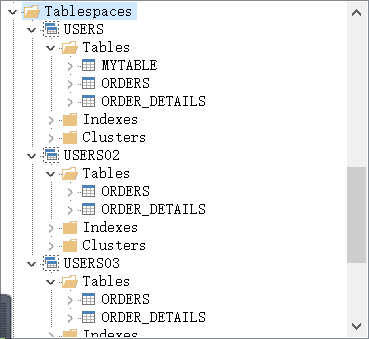
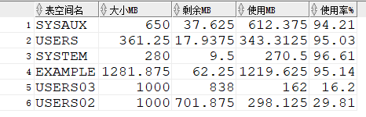
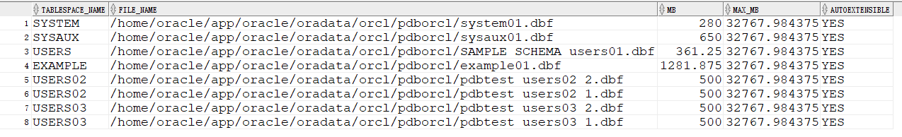

## 实验报告3（个人用户：holy_kwok）

---

_有些截图在pl/sql developer中完成，有些在sql developer中_
#### 分区，授权及创建表
```sql
ALTER USER holy_kwok QUOTA UNLIMITED on USERS02;
ALTER USER holy_kwok QUOTA UNLIMITED on USERS03;
```

```sql
grant select on v$sesstat to holy_kwok;
grant select on v_$statname to holy_kwok;
grant select on v_$session to holy_kwok;
grant SELECT_CATALOG_ROLE to holy_kwok;
grant SELECT ANY DICTIONARY to holy_kwok;
```



```sql
CREATE TABLE orders 
(
 order_id NUMBER(10, 0) NOT NULL 
 , customer_name VARCHAR2(40 BYTE) NOT NULL 
 , customer_tel VARCHAR2(40 BYTE) NOT NULL 
 , order_date DATE NOT NULL 
 , employee_id NUMBER(6, 0) NOT NULL 
 , discount NUMBER(8, 2) DEFAULT 0 
 , trade_receivable NUMBER(8, 2) DEFAULT 0 
) 
TABLESPACE USERS 
PCTFREE 10 INITRANS 1 
STORAGE (   BUFFER_POOL DEFAULT ) 
NOCOMPRESS NOPARALLEL 
PARTITION BY RANGE (order_date) 
(
 PARTITION PARTITION_BEFORE_2016 VALUES LESS THAN (
 TO_DATE(' 2016-01-01 00:00:00', 'SYYYY-MM-DD HH24:MI:SS', 
 'NLS_CALENDAR=GREGORIAN')) 
 NOLOGGING 
 TABLESPACE USERS 
 PCTFREE 10 
 INITRANS 1 
 STORAGE 
( 
 INITIAL 8388608 
 NEXT 1048576 
 MINEXTENTS 1 
 MAXEXTENTS UNLIMITED 
 BUFFER_POOL DEFAULT 
) 
NOCOMPRESS NO INMEMORY  
, PARTITION PARTITION_BEFORE_2017 VALUES LESS THAN (
TO_DATE(' 2017-01-01 00:00:00', 'SYYYY-MM-DD HH24:MI:SS', 
'NLS_CALENDAR=GREGORIAN')) 
NOLOGGING 
TABLESPACE USERS02 
PCTFREE 10 
 INITRANS 1 
 STORAGE 
( 
 INITIAL 8388608 
 NEXT 1048576 
 MINEXTENTS 1 
 MAXEXTENTS UNLIMITED 
 BUFFER_POOL DEFAULT 
) 
NOCOMPRESS NO INMEMORY  
, PARTITION PARTITION_BEFORE_2018 VALUES LESS THAN (
TO_DATE(' 2018-01-01 00:00:00', 'SYYYY-MM-DD HH24:MI:SS', 
'NLS_CALENDAR=GREGORIAN')) 
NOLOGGING 
TABLESPACE USERS03 
PCTFREE 10 
 INITRANS 1 
 STORAGE 
( 
 INITIAL 8388608 
 NEXT 1048576 
 MINEXTENTS 1 
 MAXEXTENTS UNLIMITED 
 BUFFER_POOL DEFAULT 
) 
NOCOMPRESS NO INMEMORY
);
//创建orders表

CREATE TABLE ORDER_DETAILS 
(
 id NUMBER(10, 0) NOT NULL 
, order_id NUMBER(10, 0) NOT NULL
, product_id VARCHAR2(40 BYTE) NOT NULL 
, product_num NUMBER(8, 2) NOT NULL 
, product_price NUMBER(8, 2) NOT NULL 
, CONSTRAINT order_details_fk1 FOREIGN KEY  (order_id)
REFERENCES orders  (  order_id   )
ENABLE 
) 
TABLESPACE USERS
PCTFREE 10 
PCTUSED 40 
INITRANS 1 
STORAGE 
( 
  BUFFER_POOL DEFAULT 
) 
NOCOMPRESS 
NOPARALLEL 
PARTITION BY REFERENCE (ORDER_DETAILS_FK1) 
(
  PARTITION PARTITION_BEFORE_2016 
  LOGGING 
  TABLESPACE USERS 
  PCTFREE 10 
  INITRANS 1 
  STORAGE 
  ( 
    BUFFER_POOL DEFAULT 
  ) 
  NOCOMPRESS NO INMEMORY  
, PARTITION PARTITION_BEFORE_2017 
  LOGGING 
  TABLESPACE USERS02 
  PCTFREE 10 
  INITRANS 1 
  STORAGE 
  ( 
    BUFFER_POOL DEFAULT 
  ) 
  NOCOMPRESS NO INMEMORY  
, PARTITION PARTITION_BEFORE_2018 
  LOGGING 
  TABLESPACE USERS03 
  PCTFREE 10 
  INITRANS 1 
  STORAGE 
  ( 
    BUFFER_POOL DEFAULT 
  ) 
  NOCOMPRESS NO INMEMORY  
);//创建order_detail表
```
#### 自增序列
```sql
CREATE SEQUENCE oreders_seq
MINVALUE 1
NOMAXVALUE
start with 1
INCREMENT by 1
NOCYCLE
CACHE 20;
```
```sql
set autotrace on;
select * from orders, order_details where orders.order_id = order_details.order_id(+);

create or replace trigger tr_IDADD
before insert on orders
for each row
begin
select orders_seq.nextval into :new.order_id from dual;
end;

create or replace trigger tr_DETAILS_IDADD
before insert on order_details
for each row
begin
select ORDERS_SEQ.nextval into :new.order_id from dual;
end;
```
#### 查看表分区情况
```sql
SELECT tablespace_name,FILE_NAME,BYTES/1024/1024 MB,MAXBYTES/1024/1024 MAX_MB,autoextensible FROM dba_data_files;
```

```sql
SELECT a.tablespace_name "表空间名",Total/1024/1024 "大小MB",
 free/1024/1024 "剩余MB",( total - free )/1024/1024 "使用MB",
 Round(( total - free )/ total,4)* 100 "使用率%"
 from (SELECT tablespace_name,Sum(bytes)free
        FROM   dba_free_space group  BY tablespace_name)a,
       (SELECT tablespace_name,Sum(bytes)total FROM dba_data_files
        group  BY tablespace_name)b
 where  a.tablespace_name = b.tablespace_name;
```



#### 插入大量数据
```sql
INSERT INTO orders(customer_name, customer_tel, order_date, employee_id, trade_receivable, discount) VALUES('holy', '123', to_date ( '2016-12-20 18:31:34' , 'YYYY-MM-DD HH24:MI:SS' ), 1, 1, 1);
insert into orders select * from orders;
```
